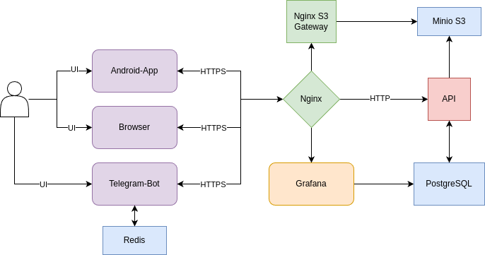
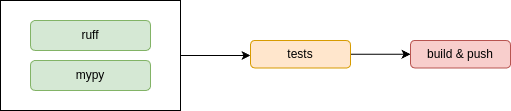

# 🚀 Mentoro — сервис для поиска менторов

 

## 📌 Описание проекта

**Mentoro** — это платформа для поиска и взаимодействия с менторами. Проект состоит из бэкенда и Android-приложения, которые взаимодействуют через REST API. Основная цель сервиса — предоставить пользователям удобный инструмент для поиска наставников, обмена знаниями и профессионального роста.

## 🏗️ Архитектура проекта

Проект включает следующие компоненты:

### 🔹 Основные компоненты бэкенда:
- **API** — REST API сервис, разработанный на **FastAPI**, обеспечивающий взаимодействие между клиентским приложением и сервером.
- **Minio** — S3-совместимое хранилище для хранения и управления изображениями.
- **Postgres** — реляционная база данных, используемая для хранения основной информации.
- **Grafana** — инструмент для визуализации метрик и мониторинга состояния системы.
- **Nginx-S3-Gateway** — реверс-прокси для Minio, поддерживающий кэширование и обеспечивающий безопасный доступ к хранилищу.
- **Nginx** — основной реверс-прокси для всего приложения, обеспечивающий HTTPS-соединение и балансировку нагрузки.

## 🗃️ Архитектура базы данных

## ⚙️ Используемые технологии

- **FastAPI** — высокопроизводительный фреймворк для создания API на Python.
- **SQLAlchemy** и **Alembic** — для работы с базой данных и управления миграциями.
- **Dishka** — для реализации dependency injection, что упрощает тестирование и поддержку кода.

## 🎯 Архитектурные принципы

Проект разработан в соответствии с принципами **чистой архитектуры** (Clean Architecture) и **SOLID**, что обеспечивает:
- Высокую модульность и масштабируемость.
- Упрощение тестирования и поддержки кода.
- Отделение бизнес-логики от инфраструктурных деталей.

## 🧪 Тестирование

Для обеспечения качества кода используются следующие инструменты и подходы:
- **pytest** — для написания unit- и интеграционных тестов.
- **coverage.py** — для измерения покрытия кода тестами.
- **E2E-тесты** — покрывают все HTTP-эндпоинты, что позволяет убедиться в корректности работы системы в целом.

> **Примечание:** Coverage не всегда отражает реальное покрытие, особенно для E2E-тестов.

## 🚀 CI/CD

В проекте настроен непрерывный процесс интеграции и доставки (CI/CD) с использованием **Gitlab CI**:

### 🔹 CI (Continuous Integration):
- Проверка форматирования кода с помощью **ruff**.
- Проверка типизации с помощью **mypy**.
- Запуск тестов для каждого коммита.

### 🔹 CD (Continuous Deployment):
- Автоматический деплой новых версий приложения, прошедших CI.
- Обновление и перезапуск контейнеров с помощью **Watchtower**.

## 🎯 Преимущества проекта

1. **📈 Масштабируемость** — чистая архитектура и использование данного стека позволяют легко расширять функциональность.
2. **✅ Надежность** — автоматизированное тестирование и CI/CD обеспечивают стабильность работы.
3. **⚡ Производительность** — использование FastAPI и кэширования через Nginx-S3-Gateway гарантирует высокую скорость работы.
4. **📌 Удобство** — подробная документация API и визуализация метрик через Grafana упрощают разработку и мониторинг.

## 📖 Документация

Документация API доступна по ссылке:  
[🔗 API Docs](https://prod-team-6-a36eo8k0.final.prodcontest.ru/docs)

### 📌 Содержание
- [📌 Заявки студента](#-заявки-студента)
- [📌 Студенты](#-студенты)
- [📌 Менторы](#-менторы)
- [📌 Отзывы](#-отзывы)

## 📌 Заявки студента
### `GET /student/request`
**Описание:** Получение всех отправленных запросов на менторство.

**Ответы:**
- `200 OK`: Успешное получение данных.
- `401 Unauthorized`: Пользователь не авторизован.
---
### `POST /student/request`
**Описание:** Создание заявки на менторство.

**Ответы:**
- `200 OK`: Заявка успешно создана.
- `401 Unauthorized`: Пользователь не авторизован.
- `404 Not Found`: Ментор не найден.
- `409 Conflict`: Создание повторной заявки невозможно.
- `422 Unprocessable Entity`: Ошибка валидации данных.

---
### `DELETE /student/request/{mentoring_request_id}`
**Описание:** Удаление заявки на менторство. Возможно только для заявок, вердикта по которым еще нет.

**Ответы:**
- `200 OK`: Заявка успешно удалена.
- `401 Unauthorized`: Пользователь не авторизован или заявка принадлежит ему.
- `409 Conflict`: Удаление невозможно, заявка уже рассмотрена.
- `422 Unprocessable Entity`: Ошибка валидации.

## 👨‍🎓 Студенты
### `POST /student/sign_up`
**Описание:** Регистрация студента.

**Ответы:**
- `200 OK`: Успешная регистрация.
- `409 Conflict`: Пользователь с таким full_name уже существует.
- `422 Unprocessable Entity`: Ошибка валидации.

---
### `POST /student/sign_in`
**Описание:** Авторизация студента.

**Ответы:**
- `200 OK`: Успешный вход.
- `401 Unauthorized`: Неверные данные для входа
- `422 Unprocessable Entity`: Ошибка валидации.

---
### `PUT /student/attach`
**Описание:** Обновление аватара студента.

**Ответы:**
- `200 OK`: Фото обновлено.
- `400 Bad Request`: Неверный тип файла.
- `413 Payload Too Large`: Файл слишком большой.
- `401 Unauthorized`: Студент не авторизован.
- `422 Unprocessable Entity`: Ошибка валидации.

---
### `GET /student/me`
**Описание:** Получение данных о себе.

**Ответы:**
- `200 OK`: Данные получены.
- `401 Unauthorized`: Студент не авторизован.

---
### `PATCH /student/`
**Описание:**: Обновление данных о студенте.

**Ответы:**
- `200 OK`: Данные обновлены.
- `401 Unauthorized`: Студент не авторизован.
- `422 Unprocessable Entity`: Ошибка валидации.

---
### `GET /student/find`
**Описание:** Поиск менторов по интересам. Возвращает список из <= 3 менторов. После свайпа пропадают

**Ответы:**
- `200 OK`: Данные получены.
- `401 Unauthorized`: Студент не авторизован.
- `422 Unprocessable Entity`: Ошибка валидации.

---
### `GET /student/swipe_mentor`
**Описание:** Свайп менторов. Регистрирует свайп и добавление в избранное.

**Ответы:**
- `200 OK`: Успешно свайпнуто.
- `401 Unauthorized`: Студент не авторизован.
- `404 Not Found`: Ментор не найден.
- `422 Unprocessable Entity`: Ошибка валидации.

---
### `GET /student/favorite`
**Описание:** Просмотр избранных менторов.

**Ответы:**
- `200 OK`: Данные получены.
- `401 Unauthorized`: Студент не авторизован.

---
### `DELETE /student/favorite/{mentor_id}`
**Описание:** Удаление избранного ментора.

**Ответы:**
- `200 OK`: Успешное удаление.
- `401 Unauthorized`: Студент не авторизован.
- `404 Not Found`: Ментор не найден.
- `422 Unprocessable Entity`: Ошибка валидации.

## 👨‍🏫 Менторы
### `POST /mentor/sign_up`
**Описание:** Регистрация ментора.

**Ответы:**
- `200 OK`: Успешная регистрация.
- `409 Conflict`: Ментор с таким full_name уже существует.
- `422 Unprocessable Entity`: Ошибка валидации.

---
### `POST /mentor/sign_in`
**Описание:** Авторизация ментора.

**Ответы:**
- `200 OK`: Успешный вход.
- `401 Unauthorized`: Неверные данные для входа.
- `422 Unprocessable Entity`: Ошибка валидации.

---
### `GET /mentor/me`
**Описание:** Получение данных о себе.

**Ответы:**
- `200 OK`: Данные получены.
- `401 Unauthorized`: Ментор не авторизован.

---
### `PUT /mentor/attach`
**Описание:** Обновление аватара ментора.

**Ответы:**
- `200 OK`: Фото обновлено.
- `400 Bad Request`: Неверный тип файла.
- `413 Payload Too Large`: Файл слишком большой.
- `401 Unauthorized`: Ментор не авторизован.
- `422 Unprocessable Entity`: Ошибка валидации.

---
### `PUT /mentor/`
**Описание:** Обновление данных о менторе.

**Ответы:**
- `200 OK`: Данные обновлены.
- `401 Unauthorized`: Ментор не авторизован.
- `422 Unprocessable Entity`: Ошибка валидации.

---
### `GET /mentor/{mentor_id}`
**Описание:** Получение данных о менторе. Контакты возвращаются только для пользователя заявка которого одобрена.

**Ответы:**
- `200 OK`: Данные получены.
- `401 Unauthorized`: Пользователь не авторизован.
- `404 Not Found`: Ментор не найден.
- `422 Unprocessable Entity`: Ошибка валидации.

---
### `GET /mentor/request`
**Описание:** Получение заявок ментором

**Ответы:**
- `200 OK`: Данные получены.
- `401 Unauthorized`: Ментор не авторизован.

---
### `POST /mentor/request/verdict`
**Описание:** Добавление вердикта к заявке.

**Ответы:**
- `200 OK`: Вердикт добавлен.
- `401 Unauthorized`: Ментор не авторизован.
- `404 Not Found`: Заявка не найдена.
- `422 Unprocessable Entity`: Ошибка валидации.

## ⭐ Отзывы
### `GET /review/{mentor_id}`
**Описание:** Получение всех отзывов о менторе.

**Ответы:**
- `200 OK`: Данные получены.
- `401 Unauthorized`: Студент не авторизован.
- `422 Unprocessable Entity`: Ошибка валидации.

---
### `GET /review/`
**Описание:** Получение всех отзывов о себе, для ментора.

**Ответы:**
- `200 OK`: Данные получены.
- `401 Unauthorized`: Ментор не авторизован.

---
### `POST /review/`
**Описание:** Добавление отзыва ментору. Можно добавить только один отзыв к ментору. Можно добавлять отзывы только к ментору заявка к которому одобрена.

**Ответы:**
- `200 OK`: Отзыв добавлен.
- `401 Unauthorized`: Студент не авторизован.
- `403 Forbidden`: Нельзя оставить отзыв.
- `422 Unprocessable Entity`: Ошибка валидации.

---
### `DELETE /review/{review_id}`
**Описание:** Удаление отзыва.

**Ответы:**
- `200 OK`: Успешное удаление.
- `401 Unauthorized`: Студент не авторизован.
- `403 Forbidden`: Отзыв создан другим пользователем.
- `404 Not Found`: Отзыв не найден.
- `422 Unprocessable Entity`: Ошибка валидации.

