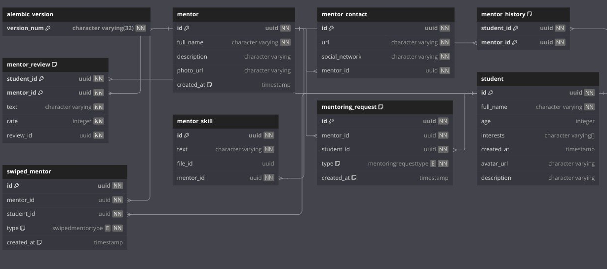

# 🗃️ Архитектура базы данных
## 📂 Схема

## 👤 Пользователи 
- postgres — пользователь под которым взаимодействует приложение.
- grafana — пользователь под которым взаимодействует инструмент Grafana. Read-only.